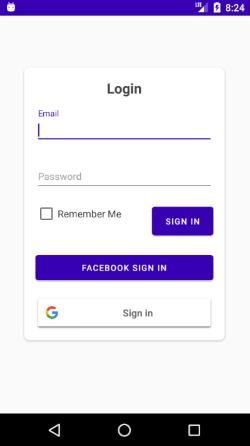
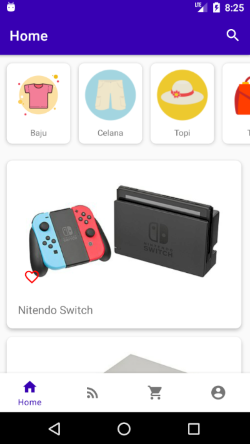
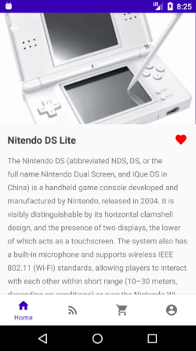
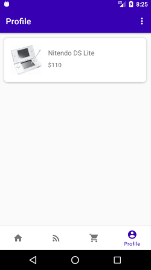
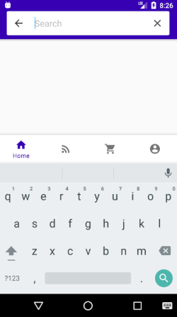

Generate your development key hash and add it to the project console for Facebook sign in.

Example: sYxkARl//5slrwasSDhhb=

https://developers.facebook.com/docs/facebook-login/android/

Generate your development SHA-1 key and add it to the project console for Google sign in.

Example: 69:EE:8E:50:EA:E9:E1:72:F9:42:68:95:B7:42:92:87:12:9Z:77:BX

https://developers.google.com/identity/sign-in/android/start-integrating

